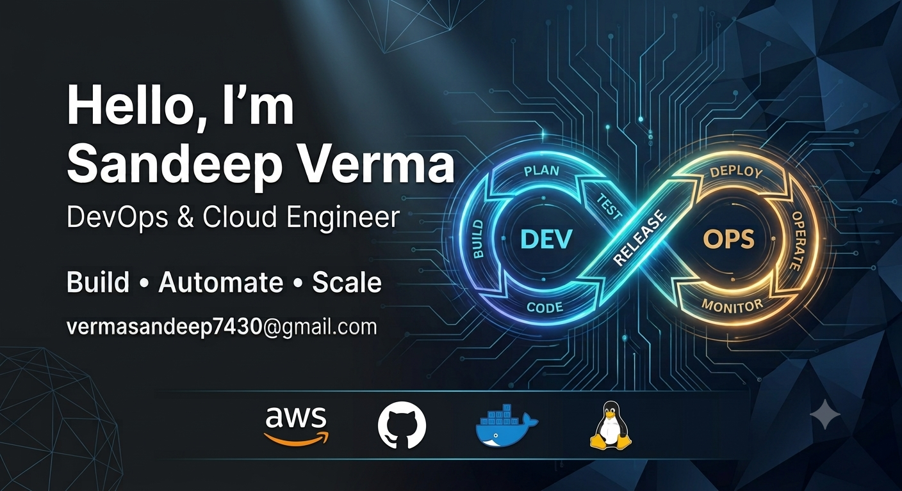

  

<h1 align="center">Hey, I'm Sandeep Verma 👋</h1>
<h3 align="center">Cloud & DevOps Engineer (Transitioning) | Ex-Incident Commander | Building in Public</h3>

  
  

---

## 🚀 About Me

I spent 3+ years managing global network incidents for Tier-1 telecom clients like Verizon, Telefonica, and Southern Cross — leading P1/P2 bridge calls, driving SLA compliance, and coordinating cross-functional teams under pressure at Ciena and Capgemini.

I was good at holding things together during a crisis. But I kept watching engineers work and realizing I didn't understand the infrastructure underneath. That gap frustrated me enough to do something about it — so I made a deliberate call to move into Cloud & DevOps, and I'm building that depth for real, in public, one project at a time.

---

## 🛠️ Tech Stack

### ☁️ Cloud & DevOps

### 💻 Programming & Scripting

### 🌐 Web & Tools

---

## 📚 Currently Learning

- 🐧 Linux — KodeKloud DevOps Engineer Path + daily hands-on practice
- 🐳 Docker & Kubernetes — coming up next in the cohort
- ☁️ AWS — hands-on via AWS Skill Builder (Cloud Practitioner in progress)
- 🔁 CI/CD, Terraform, Observability (Prometheus/Grafana) — on the path

---

## 📌 Featured Projects

### ☁️ Cloud & AWS Projects
> Hands-on AWS projects covering networking, compute, and web hosting.

- 🏗️ [3-Tier AWS VPC Architecture](https://github.com/B-Hanma/AWS-VPC-PROJECT) — Multi-AZ VPC with public/private subnets, Security Groups, and an Amazon Linux web server. Currently expanding with Load Balancer and Auto Scaling.
- 🌐 [Nginx Web Server Deployment on EC2](https://github.com/B-Hanma/nginx-ec2-deployment) — Provisioned and configured Nginx on AWS EC2; hands-on practice with service management, file permissions, and process troubleshooting.

### 🚀 Daily Practice
> My public, day-by-day DevOps learning log.

- [90DaysOfDevOps](https://github.com/B-Hanma/90DaysOfDevOps) — Linux, Git, AWS, and real troubleshooting — documented daily.

---

## 🏢 Background

- **Ciena** — Associate Network Engineer, Incident Operations *(Dec 2023 – Jul 2026)*
- **Capgemini** — Network Engineer, IAM & Access Operations *(Oct 2022 – Dec 2023)*
- 🎓 B.Tech, Electrical Engineering — JSSATE, Noida

---

## 💼 Open To Opportunities

- Junior DevOps Engineer
- Cloud Support Engineer
- Site Reliability Engineer (Entry-Level)

---

## 📊 GitHub Statistics

<!-- 

  
  

 -->

  

---

## 📈 Contribution Graph

---

## 🐍 Contribution Snake

---

## 🤝 Connect

  
 

<i>Currently open to Junior DevOps, Cloud Support, and SRE roles.</i>

